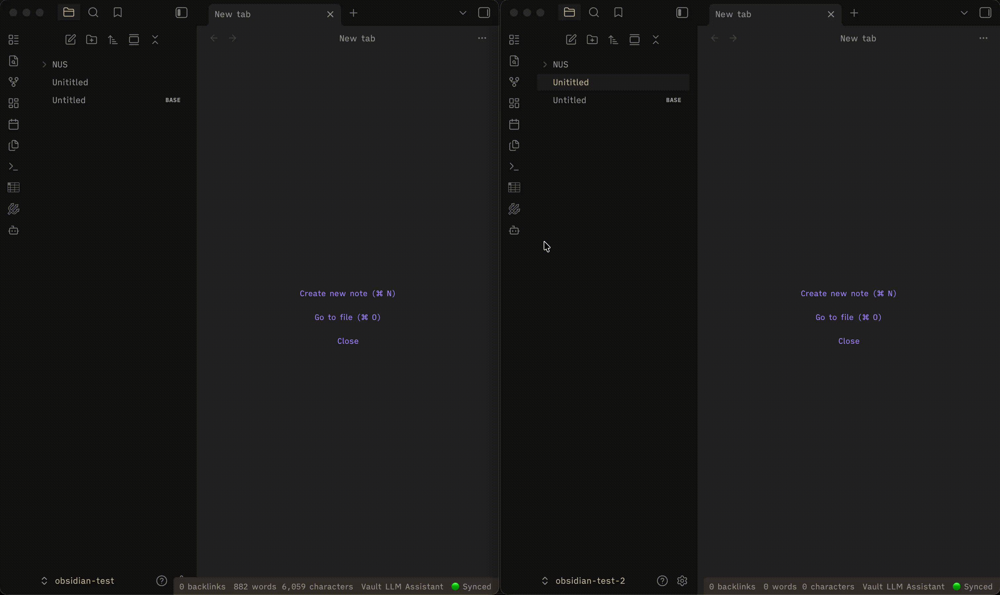

# <div align="center">SupaBase Jump for Obsidian</div>

<div align="center">
Sync your Obsidian vault with Supabase in real time. Access your notes from any device with automatic conflict resolution and live updates.
</div>

<br />

<div align="center">

**Note:** This is an unofficial way to sync and back up your notes. [Obsidian Sync](https://obsidian.md/sync) is the official supported option.

</div>

<div align="center">
  <a href="https://github.com/brianstm/obsidian-supabase-jump/releases">
    
  </a>
</div>

## Demo



> If the video is blurry, you can [download it here](assets/video-demo.mp4).

## Features

- **Real-time sync** - Changes propagate instantly across all your devices via Supabase Realtime
- **Conflict resolution** - Newer files always win (based on modification time)
- **Binary file support** - Images, PDFs, and other attachments sync via Supabase Storage
- **Frontmatter parsing** - Properties and tags from markdown frontmatter are stored in dedicated columns for SQL querying
- **Selective sync** - Exclude specific folders from syncing
- **Settings sync** - `.obsidian/` folder syncs automatically to share themes, snippets, and plugin settings across devices
- **Self-hosted support** - Works with any Supabase-compatible instance, not just supabase.com
- **Mobile compatible** - Works on both desktop and mobile Obsidian
- **One-click setup** - Automated database and storage configuration
- **Offline-first** - Local changes are queued and synced when you reconnect

## Quick Start

### 1. Create a Supabase Project

1. Go to [supabase.com](https://supabase.com) and create a free account
2. Create a new project
3. Copy your **Project URL** and **anon/public key** from **Settings → API**

### 2. Install the Plugin

The plugin is pending review in the community plugin store. Install it via **BRAT** (recommended) or manually in the meantime.

#### Install via BRAT (Recommended)

[BRAT](https://github.com/TfTHacker/obsidian42-brat) lets you install and auto-update beta plugins directly from GitHub.

1. Install the **BRAT** plugin from the Obsidian Community Plugins store
2. Open **Settings → BRAT → Add Beta Plugin**
3. Paste the repo URL: `https://github.com/brianstm/obsidian-supabase-jump`
4. Click **Add Plugin** - BRAT will install it and keep it up to date automatically

#### Manual Installation

1. Download `main.js` and `manifest.json` from the [latest release](https://github.com/brianstm/obsidian-supabase-jump/releases)
2. Create a folder: `<vault>/.obsidian/plugins/supabase-jump/`
3. Copy the files into that folder
4. Reload Obsidian and enable the plugin in **Settings → Community plugins**

### 3. Configure the Plugin

1. Open **Settings → SupaBase Jump**
2. In the **Initial Setup** section:
    - Generate a **Personal Access Token** at [supabase.com/dashboard/account/tokens](https://supabase.com/dashboard/account/tokens)
    - Paste it into the **Personal access token** field
    - Click **Run full setup** - this creates the database table, storage bucket, and enables Realtime
3. Fill in your credentials:
    - **Supabase URL** - Your project URL (e.g., `https://xxxxx.supabase.co`)
    - **Supabase anon key** - Your anon/public key
    - **Email** - Your Supabase account email
    - **Password** - Your Supabase account password
4. Click **Connect**

That's it! Your vault will start syncing automatically.

## Usage

### Automatic Sync

Once connected, the plugin automatically:

- Pushes local changes to Supabase (debounced by 2 seconds)
- Pulls remote changes from other devices in real time
- Syncs on startup (if **Sync on startup** is enabled)
- Syncs periodically based on your **Sync interval** setting

### Manual Sync

Use the **Actions** section in settings:

- **Sync now** - Full two-way sync (push + pull)
- **Fetch now** - Pull remote changes without pushing local files

Or use the command palette:

- `SupaBase Jump: Force sync now`
- `SupaBase Jump: Fetch from database`
- `SupaBase Jump: Show sync status`

### Exclude Folders

To exclude folders from syncing, add them to **Excluded folders** (comma-separated) in settings.

Example: `Templates,archive/old`

By default no folders are excluded — including `.obsidian/` and `.trash/`. If you want to keep vault settings from syncing, add `.obsidian` to your excluded list.

### Self-Hosted Supabase

The plugin works with any Supabase-compatible URL. Enter your self-hosted instance URL in the **Project URL** field. Note that the one-click setup uses the Supabase cloud management API, so for self-hosted instances you will need to run the SQL manually using the guide in the settings panel.

## How It Works

### Architecture

- **Text files** (`.md`, `.txt`, etc.) - Content stored directly in the `vault_files` PostgreSQL table
- **Binary files** (images, PDFs, etc.) - Uploaded to Supabase Storage; metadata in `vault_files`
- **Realtime sync** - Supabase Realtime broadcasts changes to all connected clients
- **Conflict resolution** - Higher `mtime` (modification time) wins

### Database Schema

The plugin creates a `vault_files` table with:

- `id` (primary key) - `{vaultId}::{filePath}` (slashes replaced with `__SLASH__`)
- `vault_id` - Unique ID for your vault (auto-generated)
- `path` - File path relative to vault root
- `content` - File content (for text files)
- `storage_path` - Supabase Storage key (for binary files)
- `frontmatter` (jsonb) - All YAML frontmatter properties from markdown files
- `tags` (text[]) - Tag array extracted from the frontmatter `tags:` field
- `mtime`, `ctime`, `size` - File metadata
- `deleted` - Soft-delete flag
- `user_id` - Row-level security (RLS) ensures you only see your own files

### Querying Frontmatter from Supabase

Once notes are synced you can query them directly from the Supabase SQL editor or any Postgres client:

```sql
-- All notes tagged "book"
SELECT path, frontmatter->>'title', tags
FROM vault_files
WHERE 'book' = ANY(tags) AND deleted = false;

-- Notes where status is not "done"
SELECT path, frontmatter->>'status'
FROM vault_files
WHERE frontmatter->>'status' != 'done' AND deleted = false;

-- Notes by a specific author, sorted by date
SELECT path, frontmatter->>'date'
FROM vault_files
WHERE frontmatter->>'author' = 'Alice'
ORDER BY frontmatter->>'date' DESC;

-- Count notes per tag
SELECT tag, COUNT(*)
FROM vault_files, unnest(tags) AS tag
WHERE deleted = false
GROUP BY tag ORDER BY count DESC;
```

Frontmatter is stored as-is from your markdown files. Any key-value pair, nested or flat, ends up queryable via the `->>` and `->` jsonb operators.

### Storage Bucket

Binary files are stored in a private `vault-attachments` bucket with:

- RLS policies ensuring users can only access their own files
- Base64url-encoded keys to handle special characters in filenames
- Original file extensions preserved for MIME type inference

## Troubleshooting

### "Setup failed at step 1/2/3"

- **Step 1 (Database)** - Check your Personal Access Token is valid and has the required permissions
- **Step 2 (Storage bucket)** - If auto-creation fails, manually create a bucket named `vault-attachments` (Private) in **Supabase → Storage**
- **Step 3 (RLS policy)** - Ensure your Supabase project has the `storage` schema enabled

### "Email not confirmed"

If you see this error after connecting:

1. Check your email inbox for a confirmation link from Supabase
2. Click the link to confirm your account
3. Click **Connect** again in the plugin settings

Or disable email confirmation:

1. Go to **Supabase → Authentication → Providers → Email**
2. Uncheck **"Confirm email"**

### Files not syncing

1. Check the status bar (bottom-right) - it should show **🟢 Synced**
2. Open the browser console (**Ctrl+Shift+I** / **Cmd+Option+I**) and look for errors
3. Verify your **Vault ID** is set in settings
4. Check that the file path is not in your **Excluded folders** list
5. Try **Sync now** manually from settings

### "Invalid key" errors

The plugin automatically handles special characters in filenames by base64url-encoding storage keys. If you still see this error:

1. Ensure you are running the latest version of the plugin
2. Check the browser console for the full error message
3. Report the issue on [GitHub](https://github.com/brianstm/obsidian-supabase-jump/issues) with the filename

## Development

### Building from Source

```bash
git clone https://github.com/brianstm/obsidian-supabase-jump.git
cd obsidian-supabase-jump
npm install
npm run dev
npm run build
```

### Project Structure

```
src/
├── main.ts          # Plugin entry point, lifecycle management
├── settings.ts      # Settings interface and UI
├── supabase.ts      # Supabase client and authentication
├── sync.ts          # File sync logic and Realtime listeners
└── frontmatter.ts   # YAML frontmatter parser
```

## Privacy & Security

- Your vault data is stored in **your own Supabase project** - not on third-party servers
- All network requests use **Row Level Security (RLS)** - you can only access your own files
- Passwords are hashed by Supabase Auth - the plugin never stores plaintext passwords
- No telemetry or analytics - the plugin is fully open source

## License

MIT - see [LICENSE](LICENSE)

## Support

- **Issues & Feature Requests** - [GitHub Issues](https://github.com/brianstm/obsidian-supabase-jump/issues)

## Acknowledgments

Built with:

- [Obsidian Plugin API](https://docs.obsidian.md)
- [Supabase](https://supabase.com)
- [Supabase JS Client](https://github.com/supabase/supabase-js)
